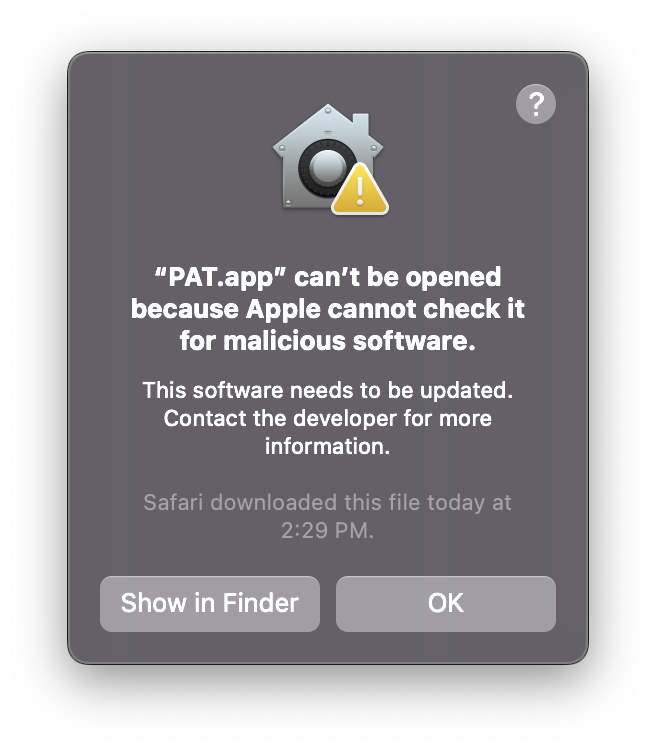
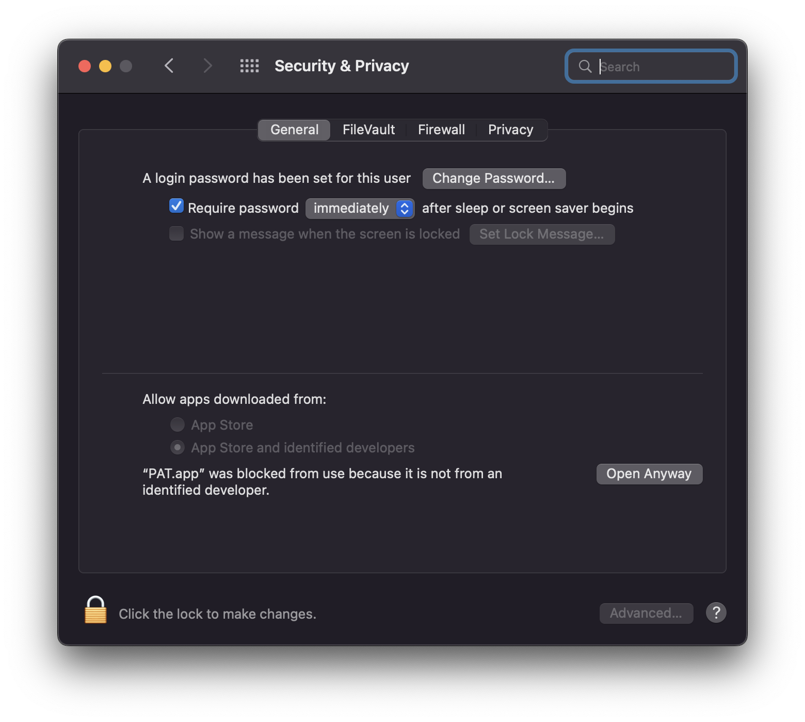
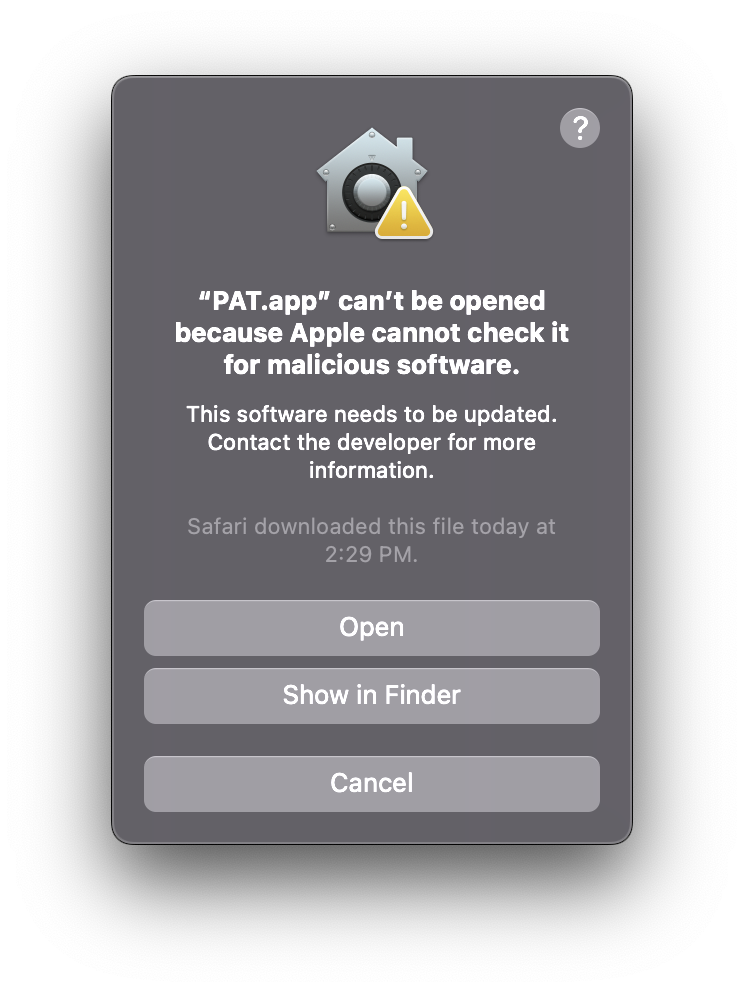

# Privilege-Recognition-Task

## Todo
1. Fix slider bugs

2. Make the round number larger

3. fix movement

## Downloading the application

### MAC instructions
1. Download the latest .zip release from [here](https://github.com/gpnlab/Privilege-Recognition-Task/releases/tag/v0.1.0)
2. Drag the downloaded .app file to your desktop or application folder
3. Double click the app icon to open it. You should get and error that looks like the image below

    

4. Then you want to go to system preferences and under that go to security and privacy you should see something similar to the image below

    

5. Click the open anyway box to open the task. If you do not see the box you need to attempt step 3 first 
6. You should see a popup and click open like the image below

    

7. After entering your participant id and selecting a config, if the game crashes after the instructions you need to drag the app out of the download folder

## Build instructions

### FOR FIRST TIME installation SETUP (MAC)
Download XCode from the following link: https://apps.apple.com/us/app/xcode/id497799835?mt=12
This should install git

### Option 1: Cloning the repo (MAC)
#### Instructions:
1. press 'cmd' + 'space'
2. Type terminal and enter
3. in the terminal, enter 'git clone https://github.com/gpnlab/Privilege-Recognition-Task'
4. Enter the following:
```bash
cd Privilege-Recognition-Task
pip3 install -r requirements.txt
python3 -m PyInstaller main.spec
mv -f dist/PAT.app ~/Desktop
```
6. The application will be on your desktop named 'PAT'; double click to run


### Option 2: Downloading the exe (ONLY FOR NONMACS)
1. Download the executable from the release window 
2. Run it and follow the directions


#### Updating the game
1. press 'cmd' + 'space'
2. Type terminal and enter
3. Delete everything in the build folder
4. in the terminal, enter the following:
```bash
cd Privilege-Recognition-Task
git pull
pip3 install -r requirements.txt
python3 -m  PyInstaller main.spec
rsync -va dist/PAT.app ~/Desktop/PAT.app
#NOTE: If prompted '...overwrite (y/N)?' enter 'y' 
```
    
4. The application is now updated on your desktop


## Game Directions
1. Answer the questionaire with the mouse and submit when done
2. Use arrow keys or WASD to move (you are player 1)
3. Collect as many coins as possible


## Features:
- 1 player vs 3 AI
- Multiple Rounds
- Record every input from the player (time-stamped by by game tick)
- Player moves up, down, left, right. Collect coins
- Experiment parameters: Coin distrobution, speed, number of rounds
- AI either has optimal, random, or "stay still" movement (random walk via markov chain)
- Feedback: Number of Coins per player/enemy
- Configuration for each "level"
- Gradient Setting for bias
- Single choice questions
- Multiple choice questions
- slider questions
- JSON configuration file
- Modular ordering of configurations
